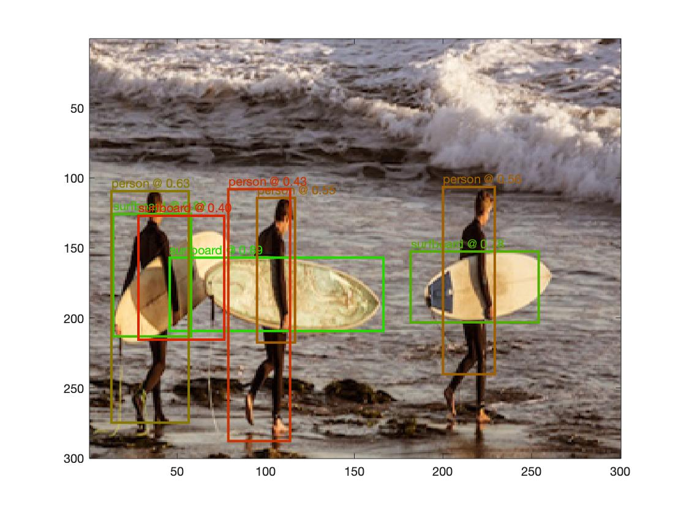

# tensorflow.m - examples

The required models and images are automatically fetched and stored in `data/` subdirectories.

1. `inference` - An inference example, based on TensorFlow's [label image example](https://github.com/tensorflow/tensorflow/tree/master/tensorflow/examples/label_image). Running the inference example on Grace Hopper results in the (top-5) labels:
```
[0.772] military uniform
[0.035] mortarboard
[0.014] academic gown
[0.010] pickelhaube
[0.006] bearskin
```

2. `detection` - An object detection example, based on TensorFlow's [multibox detector example](https://github.com/tensorflow/tensorflow/tree/master/tensorflow/examples/multibox_detector).
Two exemplary results of the detection example:
 
